# EMA-2024s
Project from the Entwicklung mobiler Anwendungen in Summersemester 2024 - HS Worms

## Installation and Test Accounts

### Installation

### Test Account
You can easily register a new account in the app or use the following test account:
| Email | Password |
| --- | --- |
| mail@gmail.com | passwort |

## Concept and Requirements

### App Idea and Vision
The app idea and vision for our fridge management app is to provide users with
a convenient way to keep track of their fridge contents and reduce food waste.
With this app, users can easily scan product barcodes or manually add items to their virtual fridge inventory.
The app will then utilize expiration date information to send timely notifications,
reminding users to consume or discard items before they expire.
By helping users stay organized and aware of their food's freshness,
our app aims to promote sustainable and efficient fridge management practices.
The app will also have a feature that suggests recipes based on the products available in the user's fridge.
It will prioritize recipes that can be prepared using the items that are close to their expiration date.
This way, users can make the most of their ingredients and reduce food waste while enjoying delicious meals.

### Target Customers Segment
The target customer segment for our fridge management app includes **individuals** and **families** who want to...

- reduce food waste
- save money
- and simplify their grocery shopping experience.

This app is ideal for busy professionals, students, and anyone who wants to stay organized and efficient in managing their fridge contents.

### Use Cases
1. **Scan Product Barcode**
   - As a user, I want to scan a product barcode to add items to my fridge inventory.
   - This feature will allow users to quickly add items to their virtual fridge by scanning the product barcode.
   - The app will automatically retrieve product information details from the barcode scan.

2. **Add Item Manually**
    - As a user, I want to manually add items to my fridge inventory.
    - This feature will allow users to add items to their virtual fridge by entering product details manually.
    - Users can input information such as product name, quantity, and expiration date.

3. **View Fridge Inventory**
    - As a user, I want to view my fridge inventory.
    - This feature will display a list of items in the user's virtual fridge.
    - Users can see product details such as name and expiration date.

4. **Receive Expiration Date Notifications**
    - As a user, I want to receive notifications for items that are close to their expiration date.
    - This feature will send timely notifications to remind users to consume or discard items before they expire.
    - Users can customize notification settings based on their preferences.

### User Stories
1. **As a user, I want to scan a product barcode to add items to my fridge inventory.**
   - **Acceptance Criteria:**
     - User can access the barcode scanner feature.
     - User can scan a product barcode.
     - App retrieves product information details from the barcode scan.

2. **As a user, I want to manually add items to my fridge inventory incase there is no barcode.**
   - **Acceptance Criteria:**
     - User can access the manual add item feature.
     - User can input product details such as name and expiration date.
     - App adds the item to the user's virtual fridge inventory.

3. **As a user, I want to view my fridge inventory.**
    - **Acceptance Criteria:**
      - User can access the fridge inventory feature.
      - App displays a list of items in the user's virtual fridge.
      - User can see product details such as name and expiration date.
      - User can filter and sort items in the fridge inventory.

4. **As a user, I want to receive notifications for items that are close to their expiration date.**
    - **Acceptance Criteria:**
      - User can access the notification settings feature.
      - User can customize notification preferences.
      - App sends timely notifications for items that are close to their expiration date.

5. **As a user, I want to receive recipe suggestions based on the products available in my fridge.**
    - **Acceptance Criteria:**
      - User can access the recipe suggestions feature.
      - App suggests recipes based on the items in the user's fridge inventory.
      - Recipes prioritize items that are close to their expiration date.

6. **As a user, I want to customize app settings such as notification preferences and theme.**
    - **Acceptance Criteria:**
      - User can access the app settings feature.
      - User can customize notification preferences and theme.
      - App saves user settings and applies them accordingly.

## Development

### Technologies Used
- **Flutter:**
    - Flutter is an open-source UI software development kit created by Google. It is used to develop applications for many platforms, but primarily Android in our case.
- **Dart:**
    - Dart is a programming language optimized for building mobile, desktop, server, and web applications. It is the primary language used for Flutter development.
- **Firebase:**
    - Firebase is a platform developed by Google for creating mobile and web applications. It provides a variety of services and we primarily used firebase authentication for user authentication.
- **Barcode Scanner: *[Mobile Scanner](https://pub.dev/packages/mobile_scanner)***
    - A universal scanner for Flutter based on MLKit. Uses CameraX on Android and AVFoundation on iOS.
- **Hive: *[Hive](https://pub.dev/packages/hive)***
    - Hive is a lightweight and blazing fast key-value database written in pure Dart.
- **OpenFoodFacts: *[OpenFoodFacts](https://pub.dev/packages/openfoodfacts)***
    - Dart package for the Open Food Facts API. Free and Easy access to more than 2.9 million food products information from all around the world.

### Api's Used
- **Open Food Facts API:**
    - Open Food Facts is a free, open, collaborative database of food products from around the world. It provides information on ingredients, nutritional values, labels, and more. We used the Open Food Facts API to retrieve product information details from barcode scans.
    - Used through the OpenFoodFacts dart package in our app.

### Project Structure
The project structure for our fridge management app is organized into different directories and files to manage the codebase effectively. Here is an overview of the project structure:

```
lib/
├── l10n/
│   ├── ...
|   └── intl_en.arb
├── src/
│   ├── data/
│   │   ├── hive_products_api/
│   │   ├── hive_settings_api/
│   │   ├── notifications_api/
│   │   ├── product_name_api/
│   │   ├── products_api/
│   │   └── settings_api/
│   ├── main/
│   │   ├── app_bloc_observer.dart
│   │   ├── bootstrap.dart
│   │   └── main.dart
│   ├── presentation/
│   │   ├── app/
│   │   |   └── app.dart
│   │   ├── auth/
│   │   |   └── auth_gate.dart
│   │   ├── pages/
│   │   |   ├── edit_product/
│   │   |   ├── products_page/
│   │   |   ├── scanner_page/
│   │   |   └── settings_page/
│   │   ├── widgets/
│   │   └── theme.dart
│   └── firebase_options.dart
└── test/
```

## Final Product
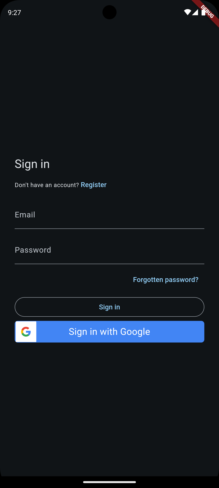
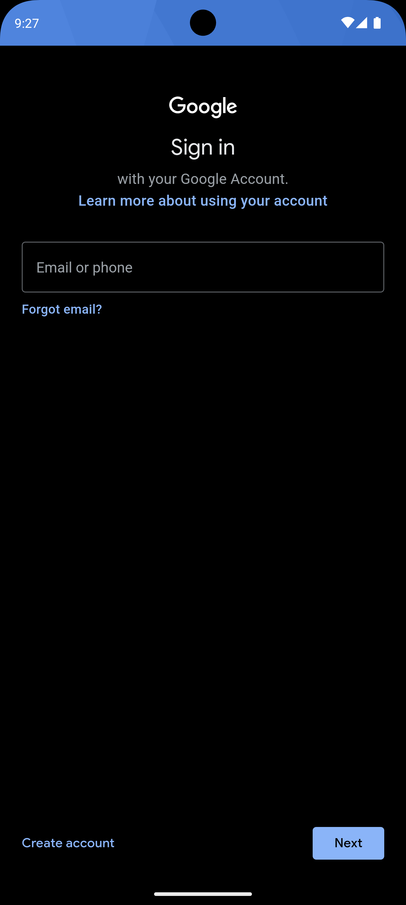
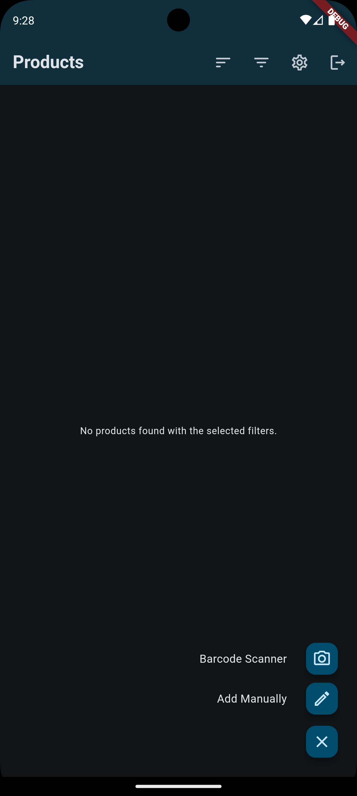
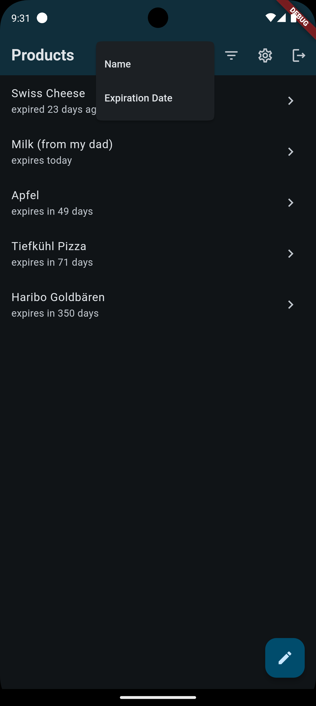
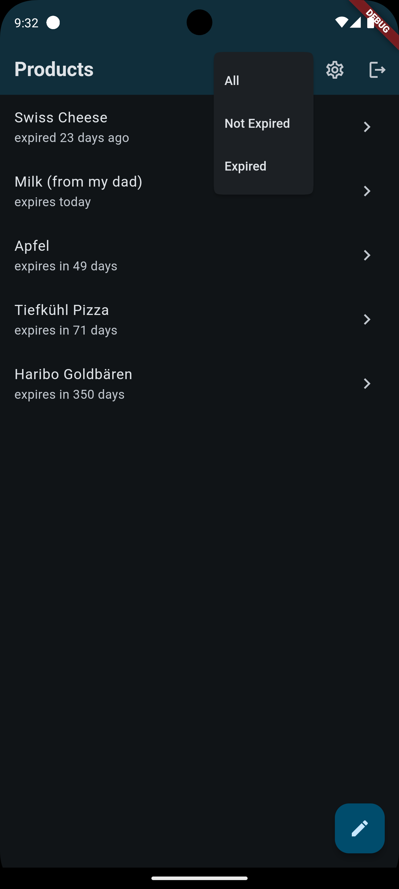
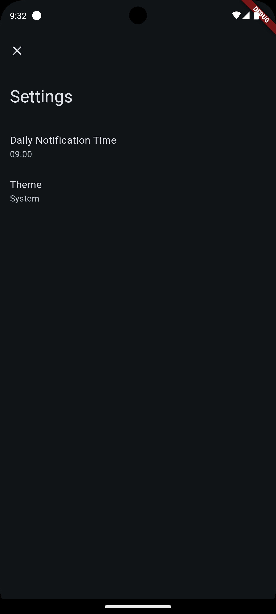
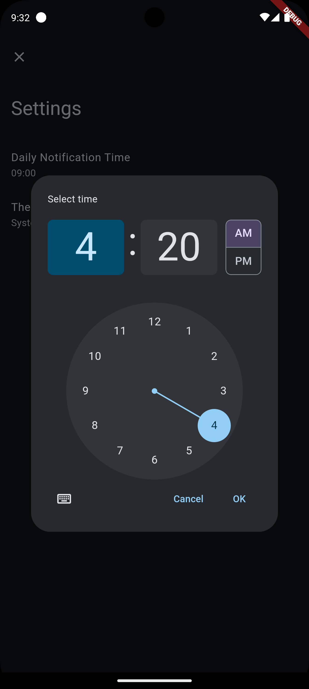
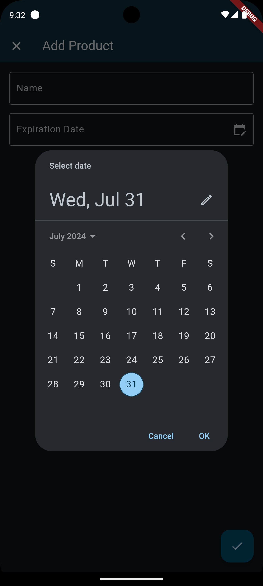
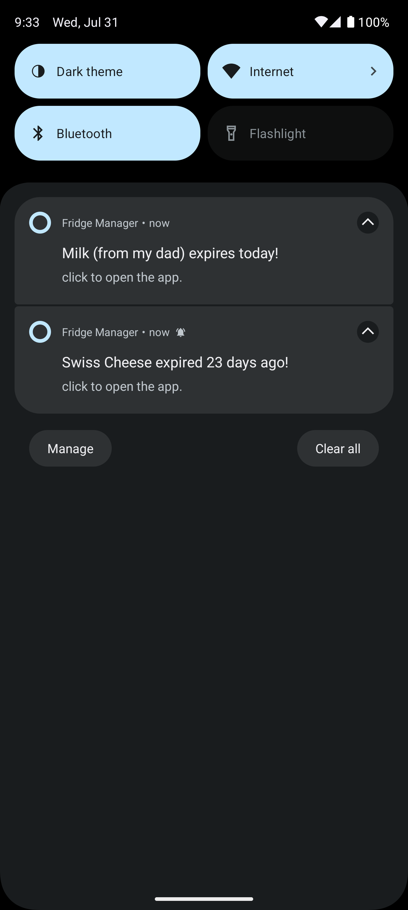
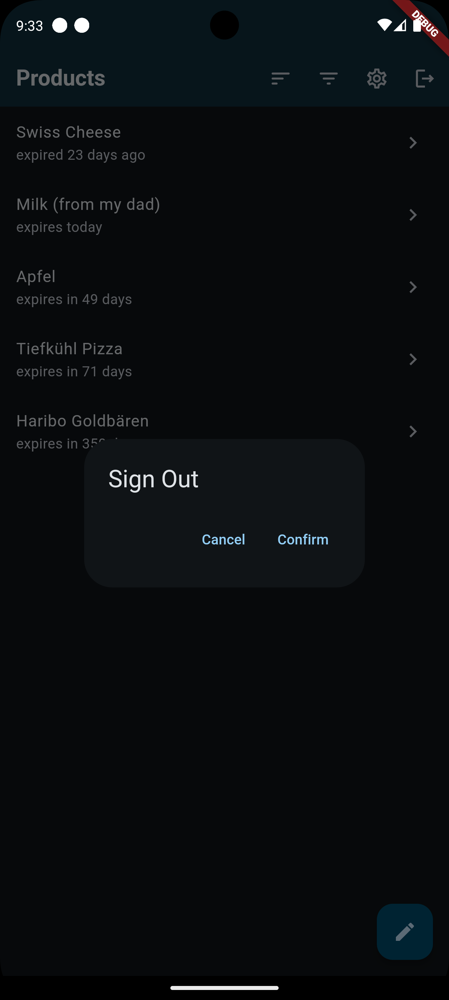
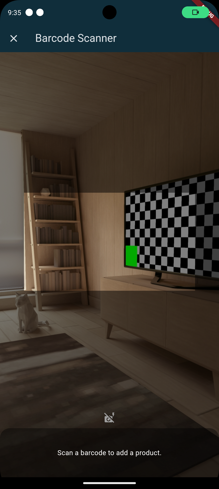

## Conclusion

### Current State
The current state of our fridge management app is a functional prototype that demonstrates
key features such as scanning product barcodes, adding items to the fridge inventory,
viewing product details, and receiving expiration date notifications.
The app has a clean and intuitive user interface that allows users to easily navigate and interact with the app's features.

In Particular, the app has the following User Stories implemented:
- **Scan Product Barcode**
- **Add Item Manually**
- **View Fridge Inventory**
- **Receive Expiration Date Notifications**
- **Customize App Settings**

### Outlook and Future Development
In the future, we plan to further develop and enhance the app by implementing additional features and improvements.
Some of the key areas for future development include:
- **Recipe Suggestions:** Implementing a feature that suggests recipes based on the items in the user's fridge inventory.
- **Data Analytics:** Providing users with insights and analytics on their food consumption and waste patterns.
- **User Profiles:** Allowing users to create profiles and customize their app experience.
- **Localization:** Supporting more languages and regions to make the app accessible to a wider audience.
- **Household Sharing:** Enabling users to share their fridge inventory with family members or roommates.

### Lessons Learned (Challenges and Solutions)
- **Challenges:**
  - Integrating the barcode scanner feature with the Open Food Facts API to retrieve product information details.
    - Only scanning food related barcodes.
    - Downtime of the Open Food Facts API.
  - Managing state and data persistence using Hive for the fridge inventory and settings.
    - Handling Widget rebuilds and data synchronization.
  - Implementing notifications and background tasks for expiration date reminders.
  - Anonymous user authentication and data synchronization with Firebase Firestore.

- **Solutions:**
  - State management
    - Using ValuelistenableBuilder and Streambuilder for reactive UI updates.
    - Using Cubit/Bloc as a state management solution.
    - Using Hive for its built-in storage persistence and fast performance.
  - Notifications
    - Using the flutter_local_notifications package for local notifications.
    - Using scheduled notifications for background expiration date reminders.
  - Authentication
    - Using Firebase Authentication for user authentication.
    - Featuring sign-in with Google and via email/password.
  - Ui/UX
    - Using Flutter's Material Design for consistent and intuitive UI components.
    - Customizing themes and colors for a visually appealing user interface.
    - Using Firebase Auth UI for a seamless authentication experience.
